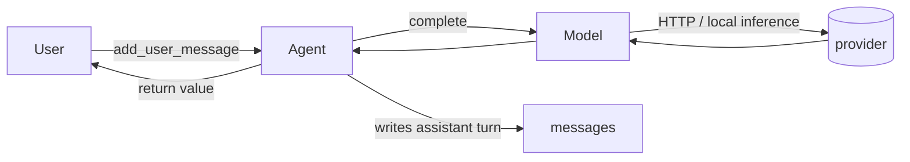

# Toki

[](https://pypi.org/project/toki/)

Minimal, universal Python interface for talking to LLMs across multiple providers.

```python
from toki import Agent, OllamaModel

model = OllamaModel("gemma4:e2b")
agent = Agent(model)

agent.add_user_message("Hello there!")
response = agent.execute()
print(response)
```

## Feature Overview
- **Same code, any backend.** OpenRouter, OpenAI, Anthropic, Google, Ollama, and local HuggingFace models all share one `BaseModel` interface; blocking completions, streaming, tools, and thinking capture work identically across providers.
- **Streaming, all the way down.** Yields content tokens, thinking tokens, *and* tool-call argument values as they arrive. Most libraries only stream content text; toki lets you consume a tool's args character-by-character while the model is still emitting them.
- **Conversation + agentic flow.** `Agent` tracks message history and tool usage; `StateMachine` / `ClassStateMachine` structure flows for complex multi-agent interactions.
- **Strongly typed surface.** Per-backend `<Provider>ModelName` literals give IDE autocomplete on real model ids; `Agent[WithStaticTools]` etc. specialize `execute()`'s return type to the tools shape you're using.
- **Minimal core, pluggable backends.** Plain `pip install toki` is dep-free; install only the extras you need (`toki[ollama]`, `toki[openrouter]`, `toki[openai]`, ...).

## Install
Backend deps are split into extras. Install only what you need:

```bash
pip install 'toki[ollama]'         # local models via a running Ollama daemon
pip install 'toki[openrouter]'     # OpenRouter HTTP API
pip install 'toki[openai]'         # OpenAI (via litellm)
pip install 'toki[anthropic]'      # Anthropic Claude (via litellm)
pip install 'toki[google]'         # Google Gemini AI Studio (via litellm)
pip install 'toki[local]'          # local models via HuggingFace transformers + torch
pip install 'toki[all]'            # everything
```

Plain `pip install toki` installs only the backend-agnostic core (`BaseModel`, `Agent`, types, state machines, `JsonStreamParser`).

## Basic Use Cases

### Streaming Chat REPL
A back-and-forth shell that streams the model's response token-by-token. Full conversation history maintained in `Agent.messages`

```python
from toki import Agent, LocalModel
from easyrepl import REPL  # pip install easyrepl

agent = Agent(LocalModel("Qwen/Qwen3:1.7b"))
for query in REPL():
    agent.add_user_message(query)
    for chunk in agent.execute(stream=True):
        print(chunk, end="", flush=True)
    print()
```


### Capture Model Reasoning
Reasoning models produce a "thinking" trace before their final answer. Pass `capture_thinking=True` to surface it.

```python
from toki import Agent, AnthropicModel, TokiThoughtResponse, get_anthropic_api_key

agent = Agent(AnthropicModel(
    "claude-sonnet-4-5",
    api_key=get_anthropic_api_key(),
    reasoning_effort="medium",
))
agent.add_user_message("Solve: which is larger, 9.9 or 9.11?")

result = agent.execute(capture_thinking=True)
assert isinstance(result, TokiThoughtResponse)
print("thought:", result.thought)
print("answer:", result.content)
```


### Simple Tool Usage
Define a tool, let the model call it, feed the result back, and let the model produce its final answer. `Agent` handles the wire-format bookkeeping so you only write the function and the dispatch logic.

```python
from toki import Agent, OpenRouterModel, TokiToolsResponse, get_openrouter_api_key

GET_WEATHER = {
    "type": "function",
    "function": {
        "name": "get_weather",
        "parameters": {
            "type": "object",
            "properties": {"city": {"type": "string"}},
            "required": ["city"],
        },
    },
}

def get_weather(city: str) -> str:
    return f"Weather in {city}: sunny, 25C"

model = OpenRouterModel("google/gemini-2.5-flash", api_key=get_openrouter_api_key())
agent = Agent(model, tools=[GET_WEATHER])

agent.add_user_message("What's the weather in Paris?")
result = agent.execute()
if isinstance(result, TokiToolsResponse):
    for call in result.tool_calls:
        agent.add_tool_message(call.id, get_weather(**call.function.arguments))
    result = agent.execute() # get the final answer using the tool result
print(result)
```

> NOTE: Tool schemas follow the OpenAI/OpenRouter schema for [function-calling](https://platform.openai.com/docs/guides/function-calling). See [json-schema](https://json-schema.org/understanding-json-schema/reference) for the full supported interface for tool function parameter schema definition.

> NOTE: For convenient schema generation, see libraries like [function-schema](https://pypi.org/project/function-schema/) or [OpenAI Agents SDK](https://pypi.org/project/openai-agents/)


## Supported Backends

| Backend     | Class             | Install            | Talks to                                | Auth                  |
|-------------|-------------------|--------------------|-----------------------------------------|-----------------------|
| Ollama      | `OllamaModel`     | `toki[ollama]`     | local Ollama daemon (auto-pulls models) | none (or `host=`)     |
| OpenRouter  | `OpenRouterModel` | `toki[openrouter]` | OpenRouter HTTP API                     | `OPENROUTER_API_KEY`  |
| OpenAI      | `OpenAIModel`     | `toki[openai]`     | OpenAI Chat Completions (via litellm)   | `OPENAI_API_KEY`      |
| Anthropic   | `AnthropicModel`  | `toki[anthropic]`  | Anthropic Messages (via litellm)        | `ANTHROPIC_API_KEY`   |
| Google      | `GoogleModel`     | `toki[google]`     | Gemini AI Studio (via litellm)          | `GEMINI_API_KEY`      |
| HuggingFace | `LocalModel`      | `toki[local]`      | local `transformers` + `torch`          | none                  |

All six implement `toki.BaseModel`, so the same code works across all of them. The minimal "say hello in 5 words" demo for each:
```python
########################### Ollama ###########################
from toki import Agent, OllamaModel

model = OllamaModel("gemma4:e2b")
agent = Agent(model)
agent.add_user_message("Say hello in 5 words")
print(f'ollama says {agent.execute()}')


########################### OpenRouter ###########################
from toki import Agent, OpenRouterModel, get_openrouter_api_key

model = OpenRouterModel("deepseek/deepseek-v3.2", api_key=get_openrouter_api_key())
agent = Agent(model)
agent.add_user_message("Say hello in 5 words")
print(f'openrouter says {agent.execute()}')


########################### OpenAI ###########################
from toki import Agent, OpenAIModel, get_openai_api_key

model = OpenAIModel("gpt-5.4-mini", api_key=get_openai_api_key())
agent = Agent(model)
agent.add_user_message("Say hello in 5 words")
print(f'openai says {agent.execute()}')


########################### Anthropic ###########################
from toki import Agent, AnthropicModel, get_anthropic_api_key

model = AnthropicModel("claude-haiku-4-5", api_key=get_anthropic_api_key())
agent = Agent(model)
agent.add_user_message("Say hello in 5 words")
print(f'anthropic says {agent.execute()}')


########################### Google ###########################
from toki import Agent, GoogleModel, get_google_api_key

model = GoogleModel("gemini-2.5-flash", api_key=get_google_api_key())
agent = Agent(model)
agent.add_user_message("Say hello in 5 words")
print(f'google says {agent.execute()}')


########################### Local/HF ###########################
from toki import Agent, LocalModel

model = LocalModel("Qwen/Qwen3-0.6B")
agent = Agent(model)
agent.add_user_message("Say hello in 5 words")
print(f'local says {agent.execute()}')
```

The `Model` constructor is the only thing that changes between backends.


### Notes:
- `OllamaModel` checks whether the requested tag is already pulled and, if not, pulls it before returning. Subsequent constructions skip straight to the chat.
- The litellm-backed frontends (`OpenAIModel`, `AnthropicModel`, `GoogleModel`) accept additional shared kwargs: `reasoning_effort`, `allow_parallel_tool_calls`, `cache`. See [Capturing Thinking](#capturing-thinking) for `reasoning_effort`.
- Toki targets instruction-tuned chat models — anything that ships a tokenizer `chat_template` (Qwen-Instruct, Llama-Instruct, Gemma-`-it`, etc.). Base / pretrained-only checkpoints aren't supported; for raw text continuation, use `transformers` directly.
- Browse all OpenRouter models: [openrouter.ai/models](https://openrouter.ai/models).

### Model-name literals

Each backend exposes a strongly-typed Literal of currently-known model ids (so your IDE autocompletes them) plus an `attributes_map` carrying per-model metadata like context window and capability flags:

```python
from toki.openrouter import OpenRouterModelName, list_openrouter_models, attributes_map

print(len(list_openrouter_models()), "models")
print(attributes_map["google/gemini-2.5-pro"])   # Attr(context_size=..., supports_tools=True)
```


The same shape exists for every backend: `from toki.<backend> import <Provider>ModelName, list_<backend>_models, attributes_map`. Backends that have additional capability flags expose them via extra `Attr` fields (e.g. `attributes_map["qwen3:1.7b"].supports_thinking` for Ollama).

Each `models.py` snapshot is regenerated by a `toki-fetch-<backend>-models` script (see [Development](#development))

> NOTE: The model-name Literals aren't exhaustive — you can pass any model id the underlying provider accepts at runtime.
```python
from toki import LocalModel
model = LocalModel("provider/some-random-huggingface-model")  #works just fine
```


## Models vs Agents

Toki separates the LLM call from the conversation around it. Two concentric layers:

- **Model** — `BaseModel.complete(messages, ...)` is *stateless*. You hand it the full message list each time; it returns one assistant turn (a string, a `TokiThoughtResponse`, a `TokiToolsResponse`, or a generator of those). Use a `<Provider>Model` directly when you want to manage history yourself or you're doing one-shot completions.
- **Agent** — `Agent(model, tools=...)` wraps a model and tracks `messages` for you. `agent.execute()` calls `model.complete(self.messages, tools=self.tools, ...)` underneath, then writes the resulting assistant turn back into `agent.messages` so the next call sees it. The `Agent[ToolsShape]` generic specializes `execute()`'s return type to the tools shape you've configured.



Most user code lives at the `Agent` layer. The `BaseModel` layer is there for direct access — useful for stateless completions, custom history shapes, and writing your own backend (see [Writing your own backend](#writing-your-own-backend)).

## Capturing Thinking

Reasoning models (OpenAI o-series, Anthropic Claude with thinking, DeepSeek-R1, QwQ, Qwen3 thinking variants, etc.) produce internal "thinking" before their final answer. By default toki strips this — your stream stays a clean stream of answer text. Pass `capture_thinking=True` to surface it as `TokiThinking` chunks (streaming) or as a `thought` field on the response object (blocking).

Streaming:
```python
from toki import Agent, AnthropicModel, TokiThinking, get_anthropic_api_key

agent = Agent(AnthropicModel(
    "claude-sonnet-4-5",
    api_key=get_anthropic_api_key(),
    reasoning_effort="medium",
))
agent.add_user_message("If a train travels 60 mph for 2.5 hours, how far does it go?")
for chunk in agent.execute(stream=True, capture_thinking=True):
    if isinstance(chunk, TokiThinking):
        print(f"\033[2m{chunk.text}\033[0m", end="", flush=True)  # dim
    else:
        print(chunk, end="", flush=True)
print()
```

Blocking:
```python
from toki import Agent, AnthropicModel, TokiThoughtResponse, get_anthropic_api_key

agent = Agent(AnthropicModel(
    "claude-sonnet-4-5",
    api_key=get_anthropic_api_key(),
    reasoning_effort="medium",
))
agent.add_user_message("Solve: 9.9 vs 9.11, which is larger?")
result = agent.execute(capture_thinking=True)
assert isinstance(result, TokiThoughtResponse)
print("thought:", result.thought)
print("answer:", result.content)
```

When tools are configured, blocking mode returns `TokiToolsThoughtResponse[T]` (which also carries a `thought` field) whenever the model invoked a tool.

Thinking text is *not* added back to message history; round-tripping reasoning context across turns is not yet supported.

### Backend nuances

How `capture_thinking=True` plumbs through to each provider:

- **Ollama** — sets the daemon's native `think` parameter. Works for thinking-flagged models in [toki/ollama/models.py](toki/ollama/models.py) (`qwen3:*`, `deepseek-r1:*`, `gpt-oss:*`, `qwq:*`); ignored on non-thinking models.
- **OpenRouter** — sets `reasoning: {enabled: true}` in the request payload.
- **Anthropic / Google** (litellm) — reliably stream thoughts back as `reasoning_content` deltas.
- **OpenAI** (litellm) — *unreliable.* OpenAI's Chat Completions endpoint doesn't return reasoning text at all, and the Responses API summaries are emitted only sporadically (especially when the response is a tool call). Server-side reasoning still happens — answers improve at higher `reasoning_effort` — you just won't see the chain.
- **Local** (transformers) — parses inline `<think>...</think>` tags inside the model's chat-template output.

### Reasoning effort

The litellm-backed frontends (`OpenAIModel`, `AnthropicModel`, `GoogleModel`) accept a `reasoning_effort` knob that controls how much the *server* thinks. It's independent of `capture_thinking` (which controls whether thoughts are surfaced to the *caller*) — you can mix and match.

```python
OpenAIModel("gpt-5.4",              api_key=..., reasoning_effort="high")
AnthropicModel("claude-sonnet-4-5", api_key=..., reasoning_effort="medium")
GoogleModel("gemini-2.5-pro",       api_key=..., reasoning_effort="low")
```

Accepted values: `'minimal' | 'low' | 'medium' | 'high' | 'xhigh'`; provider-supported subsets vary, and `None` (the default) disables reasoning entirely.

## Tools (function calling)

Pass an OpenAI-style tool schema list to `Agent(model, tools=[...])`. When the model decides to call a tool:

1. `agent.execute()` returns a `TokiToolsResponse` (or yields a `TokiToolCall` in stream mode) instead of a plain string.
2. You execute the requested function locally.
3. You feed the result back via `agent.add_tool_message(call.id, output)`.
4. You call `agent.execute()` again to get the model's final answer.

Tool schemas can be passed as raw dicts or wrapped in `ToolSchema(...)` (synonymous; the wrapper is purely for typing).

```python
from toki import Agent, OpenRouterModel, ToolSchema, TokiToolsResponse, get_openrouter_api_key

GET_WEATHER = ToolSchema({
    "type": "function",
    "function": {
        "name": "get_weather",
        "parameters": {
            "type": "object",
            "properties": {"city": {"type": "string"}},
            "required": ["city"],
        },
    },
})

def get_weather(city: str) -> str:
    return f"Weather in {city}: sunny, 25C"

model = OpenRouterModel("openai/gpt-5", api_key=get_openrouter_api_key(), allow_parallel_tool_calls=True)
agent = Agent(model, tools=[GET_WEATHER])

agent.add_user_message("What's the weather in Paris?")
result = agent.execute()
if isinstance(result, TokiToolsResponse):
    for call in result.tool_calls:
        agent.add_tool_message(call.id, get_weather(**call.function.arguments))
    print(agent.execute())  # final answer using the tool result
else:
    print(result)
```

In stream mode, each completed tool call surfaces as a `TokiToolCall` chunk as soon as the model finishes producing it:

```python
from toki import TokiToolCall

for chunk in agent.execute(stream=True):
    if isinstance(chunk, TokiToolCall):
        print(f"[tool: {chunk.function.name}({chunk.function.arguments})]")
    else:
        print(chunk, end="", flush=True)
```

Notes:
- `allow_parallel_tool_calls=True` lets the model request multiple tools at once when supported.
- See [Streaming Tools](#streaming-tools) below for tools whose argument values you want to consume *as they arrive*.
- WIP: utilities to auto-generate tool schemas from Python callables.

## Streaming vs Blocking

Every `Agent.execute()` and `BaseModel.complete()` call accepts a `stream` flag. Both code paths produce the same final `agent.messages`; they differ only in *how* the result is delivered.

**Blocking** — single return value, types depend on what's configured:

```python
text: str = agent.execute()                                          # no tools, no thinking
text_or_tools: str | TokiToolsResponse = agent.execute()              # with tools
thought: TokiThoughtResponse = agent.execute(capture_thinking=True)
```

**Streaming** — generator yielding chunks:

```python
for chunk in agent.execute(stream=True, capture_thinking=True):
    match chunk:
        case str():                ...   # content tokens
        case TokiThinking():       ...   # reasoning tokens (only when capture_thinking=True)
        case TokiToolCall():       ...   # one fully-formed static tool call
        case TokiToolCallStream(): ...   # one streaming tool call (see below)
```

The chunk types you might see depend on the agent's tools shape and `capture_thinking`. When the generator is exhausted, the assistant turn (content + any tool calls) has already been appended to `agent.messages`.

`Agent[ToolsShape]` and `complete()`'s 16 typing overloads narrow these unions to exactly what you've configured, so a static-tools agent in non-thinking blocking mode types as `str | TokiToolsResponse[TokiToolCall]`, not the full union.

### Streaming Tools

For tools whose argument values you want to consume *as they arrive* (rather than waiting for the whole call to land), declare them with `StreamingToolSchema(...)`. The schema dict is identical to the static case; the wrapper only changes how the call is surfaced.

In stream mode, each invocation of a streaming-flagged tool yields a `TokiToolCallStream` once the model has emitted the tool's id and name. Argument values are then consumed via:

- `expect_arg(name)` — returns a `TokiArgStream` for that one argument. Iterating yields decoded characters (for string args) or raw JSON-text fragments (for numbers, booleans, null, arrays, objects). Order-independent: claim args in any order, claim already-completed args as a single-shot replay, and `expect_arg` raises if the argument never appears.
- `items()` — iterates `(name, TokiArgStream)` pairs in the order the model emits them.
- `arguments` — after the stream has been drained, returns the parsed args dict.

`expect_arg` and `items()` are mutually exclusive and one-shot per `TokiToolCallStream`.

```python
from toki import Agent, OpenRouterModel, StreamingToolSchema, TokiToolCallStream, get_openrouter_api_key

PROPOSE_PATCH = StreamingToolSchema({
    "type": "function",
    "function": {
        "name": "propose_patch",
        "parameters": {
            "type": "object",
            "properties": {
                "target":      {"type": "string"},
                "replacement": {"type": "string"},
            },
            "required": ["target", "replacement"],
        },
    },
})

def handle_propose_patch(stream: TokiToolCallStream) -> None:
    target = "".join(stream.expect_arg("target"))
    print(f"--- target ---\n{target}\n--- replacement ---")
    for chunk in stream.expect_arg("replacement"):
        print(chunk, end="", flush=True)
    print()

agent = Agent(
    OpenRouterModel("openai/gpt-4o-mini", api_key=get_openrouter_api_key()),
    tools=[PROPOSE_PATCH],
)
agent.add_user_message("Propose a small patch to make `print('hi')` more enthusiastic.")
for chunk in agent.execute(stream=True):
    if isinstance(chunk, TokiToolCallStream):
        handle_propose_patch(chunk)
    else:
        print(chunk, end="", flush=True)
```

In blocking mode (`stream=False`), streaming-flagged tools still come back as `TokiToolCallStream` objects (pre-drained, so the only liveness is lost) for API symmetry — the same handler code works either way.

Mixing static and streaming tools in the same `Agent` is fine: static tools yield as `TokiToolCall`, streaming tools as `TokiToolCallStream`.

**Backend nuance: `OllamaModel`.** Ollama emits each tool call as a fully-formed object (id+name+arguments together) rather than as per-character argument deltas. `StreamingToolSchema` still works for API symmetry, but iterating a `TokiArgStream` from an Ollama call yields the entire arg value in one chunk. The first time you pass a `StreamingToolSchema` to an `OllamaModel` in `stream=True` mode, toki emits a one-shot `UserWarning`.

## Return types of `complete()` and `execute()`

`BaseModel.complete()` and `Agent.execute()` are heavily overloaded so the static return type matches what's actually possible given the flags you passed. The three knobs that matter are `stream`, `capture_thinking`, and the *shape* of `tools=` (no tools, all `ToolSchema`, all `StreamingToolSchema`, or mixed).

### Blocking (`stream=False`)
Returns a single value:

| Tools                       | `capture_thinking=False`                                       | `capture_thinking=True`                                                                |
|-----------------------------|----------------------------------------------------------------|----------------------------------------------------------------------------------------|
| none                        | `str`                                                          | `TokiThoughtResponse`                                                                  |
| `ToolSchema` only           | `str \| TokiToolsResponse[TokiToolCall]`                       | `TokiThoughtResponse \| TokiToolsThoughtResponse[TokiToolCall]`                        |
| `StreamingToolSchema` only  | `str \| TokiToolsResponse[TokiToolCallStream]`                 | `TokiThoughtResponse \| TokiToolsThoughtResponse[TokiToolCallStream]`                  |
| mixed                       | `str \| TokiToolsResponse[TokiToolCall \| TokiToolCallStream]` | `TokiThoughtResponse \| TokiToolsThoughtResponse[TokiToolCall \| TokiToolCallStream]`  |

A bare `str` means the model gave a plain answer; a `TokiToolsResponse[T]` means the model invoked one or more tools (`response.tool_calls: list[T]`); a `TokiThoughtResponse` adds a `thought` field; a `TokiToolsThoughtResponse[T]` carries both `tool_calls` and `thought`.

### Streaming (`stream=True`)
Returns a `Generator[<chunk type>, None, None]` yielding chunks of:

| Tools                       | `capture_thinking=False`                       | `capture_thinking=True`                                        |
|-----------------------------|------------------------------------------------|----------------------------------------------------------------|
| none                        | `str`                                          | `str \| TokiThinking`                                          |
| `ToolSchema` only           | `str \| TokiToolCall`                          | `str \| TokiThinking \| TokiToolCall`                          |
| `StreamingToolSchema` only  | `str \| TokiToolCallStream`                    | `str \| TokiThinking \| TokiToolCallStream`                    |
| mixed                       | `str \| TokiToolCall \| TokiToolCallStream`    | `str \| TokiThinking \| TokiToolCall \| TokiToolCallStream`    |

Once the generator is exhausted the assistant turn (content + any tool calls) has been appended to `agent.messages`, regardless of which chunk types appeared along the way.

`Agent[ToolsShape]` mirrors the tools-shape rows: `Agent[WithoutTools]`, `Agent[WithStaticTools]`, `Agent[WithStreamingTools]`, `Agent[WithMixedTools]`. Specializing `Agent` narrows `agent.execute()`'s return type to the corresponding row instead of falling back to the full union.

## Helpers

### API keys

Each hosted backend exposes a small helper that reads its conventional env var and raises if missing. Useful inside config-loading code so you fail fast at startup rather than on the first request.

```python
from toki import (
    get_openrouter_api_key,   # OPENROUTER_API_KEY
    get_openai_api_key,       # OPENAI_API_KEY
    get_anthropic_api_key,    # ANTHROPIC_API_KEY
    get_google_api_key,       # GEMINI_API_KEY
)

key = get_openrouter_api_key()  # raises ValueError if env var unset
```

### Streaming JSON parsing

Toki ships a single-object streaming JSON parser, used internally to drive `TokiArgStream` / `TokiToolCallStream`. There are two ways into it:

**Inside a tool call** — use `TokiToolCallStream.expect_arg(name)` / `items()` to consume one argument's value as it arrives. See [Streaming Tools](#streaming-tools). This is what you want 95% of the time.

**Outside a tool call** — `JsonStreamParser` is exposed at the top level for arbitrary streamed-JSON sources (e.g. parsing JSON from a custom HTTP stream). Feed it text in any chunk size; it yields tagged events as keys and values become available:

```python
from toki import JsonStreamParser

p = JsonStreamParser()
for ev in p.feed('{"city": "Par'):
    print(ev)   # ('arg_start', 'city'), ('arg_chunk', 'P'), ('arg_chunk', 'a'), ('arg_chunk', 'r')
for ev in p.feed('is", "n": 42}'):
    print(ev)   # ('arg_chunk', 'i'), ('arg_chunk', 's'), ('arg_end', 'Paris'),
                # ('arg_start', 'n'), ('arg_chunk', '4'), ('arg_chunk', '2'),
                # ('arg_end', 42), ('done', {'city': 'Paris', 'n': 42})
```

Strings stream as decoded characters; numbers / booleans / null / arrays / objects stream as raw JSON-text fragments. The parsed Python value of each top-level key is delivered in `arg_end`, and the full parsed object in `done`. Strict mode only: malformed input raises `ValueError`.

### Building CLIs with `easyrepl`

The example scripts under `examples/` use [`easyrepl`](https://pypi.org/project/easyrepl/) for input handling (history, multi-line, etc.). It isn't a toki dependency — install it separately with `pip install easyrepl` if you want the same UX:

```python
from easyrepl import REPL
from toki import Agent, OllamaModel

agent = Agent(OllamaModel("qwen3:1.7b"))
for query in REPL(history=".chat"):
    agent.add_user_message(query)
    for chunk in agent.execute(stream=True):
        print(chunk, end="", flush=True)
    print()
```

## Writing your own backend

Subclass `toki.BaseModel` and implement two methods:

- `_raw_blocking(messages, tools, *, capture_thinking, **kwargs) -> _RawTurn` — make the non-streaming call to your provider and return a single `_RawTurn(content, tool_calls, thought, usage)`.
- `_raw_streaming(messages, tools, *, capture_thinking, **kwargs) -> Iterator[_RawChunk]` — yield a stream of `_RawContentChunk` / `_RawThoughtChunk` / `_RawToolCallChunk` / `_RawUsage` events as the provider produces them.

The base class handles everything else:

- Schema unwrapping (`ToolSchema` / `StreamingToolSchema` / raw dict → wire format).
- Building typed blocking responses (`TokiThoughtResponse`, `TokiToolsResponse[T]`, `TokiToolsThoughtResponse[T]`).
- Driving `JsonStreamParser` over each tool call's `arguments_fragment` deltas to produce live `TokiToolCallStream`s.
- All 16 typing overloads on the public `complete()` entry point.

Reference implementations:
- [toki/openrouter/model.py](toki/openrouter/model.py) — direct HTTP, smallest reference.
- [toki/litellm/model.py](toki/litellm/model.py) — wraps litellm; shared base for `OpenAIModel` / `AnthropicModel` / `GoogleModel`.
- [toki/ollama/model.py](toki/ollama/model.py) — wraps the official `ollama` python client; demonstrates synthesizing a single-fragment tool-call delta for providers that emit whole tool calls.
- [toki/local/transformers.py](toki/local/transformers.py) — fully local; demonstrates inline `<think>` tag parsing and `<tool_call>` envelope extraction without the help of a structured streaming protocol.

### State machines

Toki ships lightweight state machines for structuring multi-step interactions. They're "implicit" in that transitions are controlled solely by the return value of each handler — there's no global graph definition. Pair them with a `BaseModel` or `Agent` inside each handler to build small ReAct-style flows where each state is a model call that decides what comes next.

Function + context version:
```python
from enum import Enum, auto
from dataclasses import dataclass
from toki import StateMachine, END_STATE

class State(Enum):
    A = auto()
    B = auto()
    C = auto()

@dataclass
class Context:
    name: str

def a(ctx: Context):
    print(f"{ctx.name} handling A")
    return State.B

def b(ctx: Context):
    print(f"{ctx.name} handling B")
    return State.C

def c(ctx: Context):
    print(f"{ctx.name} handling C")
    return END_STATE

sm = StateMachine(State, {State.A: a, State.B: b, State.C: c})
for s in sm.run(State.A, context=Context("Alice")):
    ...
```

Class-based version:
```python
from enum import Enum, auto
from toki import ClassStateMachine, on, END_STATE

class State(Enum):
    A = auto(); B = auto(); C = auto()

class Scenario:
    def __init__(self, name: str):
        self.name = name

    @on(State.A)
    def a(self):
        print(f"{self.name} handling A")
        return State.B

    @on(State.B)
    def b(self):
        print(f"{self.name} handling B")
        return State.C

    @on(State.C)
    def c(self):
        print(f"{self.name} handling C")
        return END_STATE

sm = ClassStateMachine(Scenario("Bob"))
for s in sm.run(State.A):
    ...
```

Each handler returns the next `State` (or `END_STATE` to terminate).


## Roadmap

- **Painless caching.** All hosted backends already accept a `cache=False` constructor kwarg; today it's a no-op (with a warning when set to `True`). Plan: per backend handling of using caching for model conversation and response. Toki interface will be `caching=True` wheras backends will perform whatever steps necessary to activate the cache for that particular provider (if they support caching)
- **Async support.** Likely will consist of a set of helper functions that convert model generator responses into async responses. TBD if it's straightforward to integrate these into async methods models/agents can provide, or if it will be up to the end user to wrap the synchronous methods.
- **ReAct-style agents.** Examples — and possibly a small helper — orchestrating "thought / action / observation" loops on top of `Agent` + tools and a `StateMachine`.
- **Tool-schema generation from Python callables.** clear examples of supporting libraries that can help converting functions to schemas for tool calling. perhaps a minimal interface or demo of the ReAct flow. Additionally, may include functionality for augmenting non-tool-supporting models with tools via a plain-text interface

## Development
- Python ≥ 3.10
- install all deps for dev: `uv sync --extra all'`
- Useful scripts:
  - `toki-fetch-openrouter-models` — regenerate `toki/openrouter/models.py` from the live OpenRouter API
  - `toki-fetch-local-models` — regenerate `toki/local/models.py` from popular HuggingFace chat models
  - `toki-fetch-openai-models` / `toki-fetch-anthropic-models` / `toki-fetch-google-models` — regenerate the per-provider `models.py` snapshots from litellm's bundled metadata
  - `toki-fetch-ollama-models` — regenerate `toki/ollama/models.py` by scraping the popular page of the Ollama library; merges new tags in and prunes any that have been removed from the registry
  - `uv version --bump <level>` where `<level>` is one of `major`, `minor`, or `patch`
